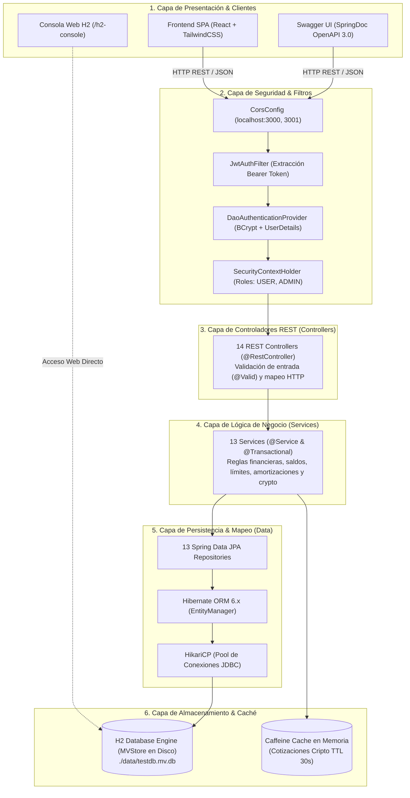
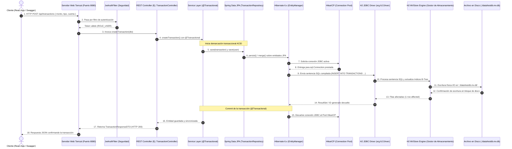

# 🏗️ NeoBank — Arquitectura del Backend, Estructura del Proyecto y Base de Datos

---

## 📑 Tabla de Contenidos
1. [Arquitectura General del Backend](#1-arquitectura-general-del-backend)
2. [Estructura Completa del Proyecto](#2-estructura-completa-del-proyecto)
3. [Tabla de Responsabilidad por Paquete](#3-tabla-de-responsabilidad-por-paquete)
4. [Herramientas de Desarrollo de Todo el Sistema](#4-herramientas-de-desarrollo-de-todo-el-sistema)
5. [Base de Datos del Sistema: H2 Database](#5-base-de-datos-del-sistema-h2-database)
   - [5.1 Motor Seleccionado y Justificación](#51-motor-seleccionado-y-justificación)
   - [5.2 Modo de Funcionamiento y Persistencia](#52-modo-de-funcionamiento-y-persistencia)
   - [5.3 Gestión de Esquema y Seeding (Inicialización)](#53-gestión-de-esquema-y-seeding-inicialización)
   - [5.4 Consola Web y Acceso Administrativo](#54-consola-web-y-acceso-administrativo)
   - [5.5 Diagrama de la Ruta de Conexiones de la Base de Datos](#55-diagrama-de-la-ruta-de-conexiones-de-la-base-de-datos)

---

## 1. Arquitectura General del Backend

El backend de **NeoBank** está construido sobre el framework **Spring Boot 3.5.3** con **Java 21**, implementando un patrón arquitectónico **Monolítico Modular en Capas (*Layered Architecture*)** desacoplado de la interfaz de usuario en **React 18 / 19**.



### Principios de Diseño Arquitectónico:
1. **Desacoplamiento Estricto con DTOs:** Las entidades JPA de base de datos nunca se exponen directamente a los endpoints públicos; toda la comunicación cliente-servidor se gestiona a través de *Data Transfer Objects* (DTOs) y mappers dedicados.
2. **Atomicidad y Consistencia ACID:** Todos los movimientos de fondos (transferencias, depósitos, retiros, pagos de cuotas y desembolsos) están blindados con la anotación `@Transactional`. Si cualquier fase falla (por ejemplo, saldo insuficiente o cuenta congelada), el framework realiza un *rollback* completo e inmediato.
3. **Seguridad Stateless basada en Claims:** La aplicación no almacena sesiones en el servidor (`SessionCreationPolicy.STATELESS`). Cada petición HTTP transporta un token criptográfico firmado con algoritmo HMAC-SHA256 que acredita identidad y roles.

---

## 2. Estructura Completa del Proyecto

A continuación se presenta el árbol de directorios de la solución completa, desglosando la estructura raíz y el empaquetado interno del backend:

```text
neobank_/
├── .git/                                # Control de versiones Git
├── .gitignore                           # Exclusiones de Git (node_modules, target, data)
├── README.md                            # Guía de inicio rápido del proyecto
├── docs/                                # Documentación de ingeniería de software
│   ├── DOCUMENTACION_SISTEMA_BACKEND_APIS.md    # Especificación de APIs, RF y CU
│   ├── DOCUMENTACION_SISTEMA_BACKEND_APIS.html  # Versión interactiva con Mermaid.js
│   ├── DOCUMENTACION_SISTEMA_BACKEND_APIS.doc   # Versión formateada para Microsoft Word
│   └── ARQUITECTURA_Y_ESTRUCTURA_BACKEND.md     # Este documento (Arquitectura y DB)
│
├── frontend/                            # Aplicación Web SPA (React 18 / 19)
│   ├── package.json                     # Dependencias (axios, lucide-react, recharts, etc.)
│   ├── public/                          # Recursos públicos y HTML base (index.html)
│   └── src/                             # Código fuente React (Componentes, Vistas, Hooks)
│
└── backend/                             # Servidor Backend (Spring Boot 3.5.3)
    ├── pom.xml                          # Descriptor de dependencias Maven
    ├── .mvn/                            # Configuración del Maven Wrapper
    ├── mvnw / mvnw.cmd                  # Ejecutables del Maven Wrapper
    │
    ├── data/                            # Directorio de persistencia física de la Base de Datos
    │   ├── testdb.mv.db                 # Archivo binario de datos H2 (MVStore Engine)
    │   └── testdb.trace.db              # Registro de trazas de diagnóstico de H2
    │
    └── src/
        ├── test/                        # Pruebas unitarias e integración (JUnit 5, Mockito)
        └── main/
            ├── resources/               # Configuración y recursos estáticos
            │   └── application.properties # Parámetros de H2, JPA, Hibernate y Cripto
            │
            └── java/com/neobank/backend/ # Código fuente Java estructurado en paquetes
                ├── BackendApplication.java # Clase principal de arranque (@SpringBootApplication)
                │
                ├── Auth/                # Módulo de Autenticación y Registro inicial
                ├── Config/              # Clases de configuración de infraestructura
                ├── Controller/          # Puntos de entrada REST para el cliente
                ├── crypto/              # Módulo de simulación de Criptomonedas y Órdenes
                ├── DTO/                 # Objetos de Transferencia de Datos
                ├── Exceptions/          # Manejo global de excepciones y códigos de error
                ├── Mapper/              # Transformadores Entidad <-> DTO
                ├── Model/               # Entidades del Dominio Bancario (JPA / Hibernate)
                ├── Repository/          # Interfaces de Persistencia (Spring Data JPA)
                ├── Security/            # Filtros, JWT y detalles de usuario de Spring Security
                └── Service/             # Servicios transaccionales y lógica de negocio
```

---

## 3. Tabla de Responsabilidad por Paquete

El paquete raíz `com.neobank.backend` está segmentado en **11 subpaquetes especializados** conforme a la separación de conceptos (*Separation of Concerns*):

| Paquete | Responsabilidad Principal | Clases Clave | Patrón / Tecnología Aplicada |
|---|---|---|---|
| **`Auth`** | Gestiona el registro de usuarios, login, generación inicial de tokens y endpoints de identidad del usuario en sesión (`/me`). | [`AuthController`](file:///home/Bruhxx/Documents/neobank_/backend/src/main/java/com/neobank/backend/Auth/AuthController.java), [`AuthService`](file:///home/Bruhxx/Documents/neobank_/backend/src/main/java/com/neobank/backend/Auth/AuthService.java), `AuthRequest`, `AuthResponse`, `LoginRequest` | REST Controller, Service Layer, Authentication Flow |
| **`Config`** | Centraliza la parametrización de la seguridad, políticas de CORS para el frontend, especificación de OpenAPI/Swagger y el sembrado inicial de datos (*Data Seeding*). | [`SecurityConfig`](file:///home/Bruhxx/Documents/neobank_/backend/src/main/java/com/neobank/backend/Config/SecurityConfig.java), [`CorsConfig`](file:///home/Bruhxx/Documents/neobank_/backend/src/main/java/com/neobank/backend/Config/CorsConfig.java), [`OpenAPIConfig`](file:///home/Bruhxx/Documents/neobank_/backend/src/main/java/com/neobank/backend/Config/OpenAPIConfig.java), [`DataInitializer`](file:///home/Bruhxx/Documents/neobank_/backend/src/main/java/com/neobank/backend/Config/DataInitializer.java) | `@Configuration`, Spring Security DSL, `CommandLineRunner` |
| **`Controller`** | Expone los endpoints REST para todas las funcionalidades financieras del banco, valida payloads entrantes y mapea respuestas a códigos HTTP estándar. | [`TransactionController`](file:///home/Bruhxx/Documents/neobank_/backend/src/main/java/com/neobank/backend/Controller/TransactionController.java), [`VirtualCardController`](file:///home/Bruhxx/Documents/neobank_/backend/src/main/java/com/neobank/backend/Controller/VirtualCardController.java), [`LoanController`](file:///home/Bruhxx/Documents/neobank_/backend/src/main/java/com/neobank/backend/Controller/LoanController.java), [`VaultController`](file:///home/Bruhxx/Documents/neobank_/backend/src/main/java/com/neobank/backend/Controller/VaultController.java), [`AdminController`](file:///home/Bruhxx/Documents/neobank_/backend/src/main/java/com/neobank/backend/Controller/AdminController.java), [`AdminDatabaseController`](file:///home/Bruhxx/Documents/neobank_/backend/src/main/java/com/neobank/backend/Controller/AdminDatabaseController.java), [`ScheduledPaymentController`](file:///home/Bruhxx/Documents/neobank_/backend/src/main/java/com/neobank/backend/Controller/ScheduledPaymentController.java), etc. | `@RestController`, `@RequestMapping`, `@PreAuthorize` (RBAC) |
| **`crypto`** | Módulo autónomo para simulación de compra/venta de criptomonedas, caché de tickers, calculadora de cambio y persistencia de billeteras cripto (*holdings*). | [`CryptoController`](file:///home/Bruhxx/Documents/neobank_/backend/src/main/java/com/neobank/backend/crypto/CryptoController.java), [`CryptoService`](file:///home/Bruhxx/Documents/neobank_/backend/src/main/java/com/neobank/backend/crypto/CryptoService.java), `MarketDataService`, `PaperExchangeService`, `CryptoHolding`, `CryptoOrder` | Bounded Context, Gateway Pattern, In-Memory Caching |
| **`DTO`** | Define contratos de datos inmutables y validados para transferir información entre el cliente y el servidor sin exponer la estructura de la base de datos. | `TransactionRequestDTO`, `TransactionResponseDTO`, `VirtualCardDTO`, `VaultDTO`, `LoanResponseDTO`, `AdminOverviewDTO`, `CategorySpendingDTO`, etc. | Data Transfer Object (DTO), Builder Pattern (Lombok), Bean Validation |
| **`Exceptions`** | Intercepta fallos de negocio, errores de autorización y violaciones de restricciones para transformarlos en respuestas HTTP limpias y estructuradas en formato JSON. | `GlobalExceptionHandler`, `UserNotFoundException` | `@RestControllerAdvice`, `@ExceptionHandler` |
| **`Mapper`** | Convierte entidades de dominio JPA en objetos DTO y viceversa, encapsulando la lógica de transformación de atributos y ocultando datos sensibles (como contraseñas). | `UserMapper`, `AuditLogMapper` | Object-to-Object Mapping (Data Mapper Pattern) |
| **`Model`** | Modela el dominio bancario mediante entidades relacionales mapeadas a tablas de base de datos con sus respectivas relaciones (1:N, N:1) y enumeradores. | [`User`](file:///home/Bruhxx/Documents/neobank_/backend/src/main/java/com/neobank/backend/Model/User.java), [`Transaction`](file:///home/Bruhxx/Documents/neobank_/backend/src/main/java/com/neobank/backend/Model/Transaction.java), [`VirtualCard`](file:///home/Bruhxx/Documents/neobank_/backend/src/main/java/com/neobank/backend/Model/VirtualCard.java), [`Vault`](file:///home/Bruhxx/Documents/neobank_/backend/src/main/java/com/neobank/backend/Model/Vault.java), [`Loan`](file:///home/Bruhxx/Documents/neobank_/backend/src/main/java/com/neobank/backend/Model/Loan.java), [`LoanPayment`](file:///home/Bruhxx/Documents/neobank_/backend/src/main/java/com/neobank/backend/Model/LoanPayment.java), [`ScheduledPayment`](file:///home/Bruhxx/Documents/neobank_/backend/src/main/java/com/neobank/backend/Model/ScheduledPayment.java), [`Budget`](file:///home/Bruhxx/Documents/neobank_/backend/src/main/java/com/neobank/backend/Model/Budget.java), [`AuditLog`](file:///home/Bruhxx/Documents/neobank_/backend/src/main/java/com/neobank/backend/Model/AuditLog.java), [`SecurityIncident`](file:///home/Bruhxx/Documents/neobank_/backend/src/main/java/com/neobank/backend/Model/SecurityIncident.java) | Domain Model, JPA `@Entity`, `@Table`, Hibernate |
| **`Repository`** | Capa de abstracción sobre la base de datos H2; provee operaciones CRUD automáticas, consultas derivadas por nombre de método y consultas personalizadas con JPQL. | `UserRepository`, `TransactionRepository`, `VirtualCardRepository`, `VaultRepository`, `LoanRepository`, `ScheduledPaymentRepository`, `AuditLogRepository`, etc. | Spring Data JPA Repositories (`JpaRepository`) |
| **`Security`** | Implementa los filtros del ciclo de vida HTTP, autenticación mediante tokens JWT, extracción de credenciales del encabezado `Authorization` y carga de usuarios del repositorio. | [`JwtAuthFilter`](file:///home/Bruhxx/Documents/neobank_/backend/src/main/java/com/neobank/backend/Security/JwtAuthFilter.java), [`JwtService`](file:///home/Bruhxx/Documents/neobank_/backend/src/main/java/com/neobank/backend/Security/JwtService.java), `CustomUserDetails`, `CustomUserDetailService` | OncePerRequestFilter, JJWT (HMAC-SHA256), UserDetailsService |
| **`Service`** | Contiene la lógica central de negocio financiero, aplicación de reglas transaccionales ACID, cálculos matemáticos bancarios, generación de alertas y registro de auditoría. | [`TransactionService`](file:///home/Bruhxx/Documents/neobank_/backend/src/main/java/com/neobank/backend/Service/TransactionService.java), [`LoanService`](file:///home/Bruhxx/Documents/neobank_/backend/src/main/java/com/neobank/backend/Service/LoanService.java), [`VirtualCardService`](file:///home/Bruhxx/Documents/neobank_/backend/src/main/java/com/neobank/backend/Service/VirtualCardService.java), [`VaultService`](file:///home/Bruhxx/Documents/neobank_/backend/src/main/java/com/neobank/backend/Service/VaultService.java), [`AdminService`](file:///home/Bruhxx/Documents/neobank_/backend/src/main/java/com/neobank/backend/Service/AdminService.java), [`ScheduledPaymentService`](file:///home/Bruhxx/Documents/neobank_/backend/src/main/java/com/neobank/backend/Service/ScheduledPaymentService.java), [`NotificationService`](file:///home/Bruhxx/Documents/neobank_/backend/src/main/java/com/neobank/backend/Service/NotificationService.java) | Service Layer Pattern, Declarative Transactions (`@Transactional`) |

---

## 4. Herramientas de Desarrollo de Todo el Sistema

El ecosistema de herramientas implementado cubre el ciclo de vida completo de desarrollo, empaquetado, pruebas e interfaz:

### 4.1 Backend (Java / Spring Boot)
- **Java Development Kit (JDK 21 LTS):** Motor de ejecución con características modernas (Pattern Matching, Records, Virtual Threads).
- **Apache Maven 3.9+ (con Maven Wrapper `mvnw`):** Gestión de dependencias, compilación y ciclo de vida de construcción.
- **Spring Boot Starter Web:** Servidor web embebido **Apache Tomcat 10.1** y arquitectura MVC.
- **Spring Boot Starter Security:** Framework de autenticación, autorización basada en expresiones y protección de endpoints.
- **JJWT (Java JWT 0.11.5):** Biblioteca criptográfica para generación, firma digital HMAC-SHA256 y parseo de tokens JSON Web Tokens.
- **Spring Data JPA & Hibernate 6.x:** ORM para mapeo de entidades a tablas relacionales y gestión transaccional automática.
- **Jakarta Bean Validation:** Motor de validación de modelos (`@NotNull`, `@Size`, `@Min`, `@Email`).
- **Project Lombok:** Procesador de anotaciones en tiempo de compilación para generar constructores, getters, setters y builders (`@Data`, `@Builder`, `@RequiredArgsConstructor`).
- **SpringDoc OpenAPI 2.7.0:** Generador automático de documentación Swagger UI accesible en `/swagger-ui/index.html`.
- **Caffeine Cache:** Motor de almacenamiento en memoria de ultra alta velocidad para cotizaciones con política de desalojo por tiempo (TTL 30s).
- **Spring WebFlux (WebClient):** Cliente HTTP reactivo y no bloqueante para consultas externas.
- **Spring Boot DevTools:** Recarga en caliente (*Hot Swapping*) durante el desarrollo local.
- **JUnit 5 & Mockito (Spring Boot Starter Test):** Suite de pruebas unitarias y de integración, complementada con `spring-security-test`.

### 4.2 Frontend (React / Node.js)
- **Node.js (v18+ o v20 LTS) & npm:** Entorno de ejecución de JavaScript y gestor de paquetes.
- **React 19.1.1 & React DOM:** Biblioteca declarativa para la construcción de interfaces de usuario basadas en componentes funcionales y Hooks.
- **React Router DOM 6.30.1:** Enrutador de cliente para navegación SPA entre vistas (`/dashboard`, `/admin`, `/login`, etc.).
- **Axios 1.11.0:** Cliente HTTP basado en promesas con interceptores para inyectar automáticamente el Bearer Token en cada solicitud.
- **TailwindCSS:** Framework de estilos utilitarios para diseño responsivo y estética bancaria moderna.
- **Lucide React (0.535.0):** Colección de iconos vectoriales para acciones financieras (tarjetas, transferencias, bóvedas).
- **Recharts (3.1.0):** Biblioteca de gráficos para visualizar tendencias de gastos y analítica mensual.
- **Framer Motion & Lottie React:** Animaciones fluidas para transiciones de pantalla e interacción bancaria.
- **Cypress 14.5.4:** Herramienta de pruebas End-to-End (E2E) para automatización de flujos de usuario en el navegador.

---

## 5. Base de Datos del Sistema: H2 Database

### 5.1 Motor Seleccionado y Justificación
El sistema NeoBank utiliza **H2 Database Engine**, un motor de base de datos relacional de código abierto escrito enteramente en Java.

**¿Por qué se eligió H2?**
1. **Cero Dependencias Externas:** No requiere instalar ni configurar servicios adicionales de bases de datos (como MySQL o PostgreSQL) para ejecutar el proyecto en cualquier máquina de desarrollo o servidor de demostración.
2. **Compatibilidad Estricta con SQL Estándar:** Cumple con la sintaxis SQL-92, soporte completo de transacciones ACID, claves primarias compuestas, claves foráneas e índices.
3. **Consola Web Integrada:** Incorpora una interfaz gráfica de administración accesible directamente desde el navegador web.

---

### 5.2 Modo de Funcionamiento y Persistencia

A diferencia de las configuraciones típicas de prueba donde H2 opera puramente en memoria volátil (`jdbc:h2:mem:...`), en NeoBank **H2 está configurado en modo archivo persistente en disco (*Standalone File-Based Mode*)**:

Configuración en [`application.properties`](file:///home/Bruhxx/Documents/neobank_/backend/src/main/resources/application.properties):
```properties
spring.datasource.url=jdbc:h2:file:./data/testdb;DB_CLOSE_ON_EXIT=FALSE;AUTO_RECONNECT=TRUE
spring.datasource.driverClassName=org.h2.Driver
spring.datasource.username=sa
spring.datasource.password=

spring.jpa.database-platform=org.hibernate.dialect.H2Dialect
spring.jpa.hibernate.ddl-auto=update
spring.jpa.show-sql=true

spring.h2.console.enabled=true
spring.h2.console.path=/h2-console
```

#### Parámetros Clave:
- `jdbc:h2:file:./data/testdb`: Especifica que la base de datos se almacena en el sistema de archivos local, dentro de la carpeta `backend/data/`. H2 crea físicamente el archivo **`testdb.mv.db`** (utilizando el motor de almacenamiento *MVStore*, concurrencia multiversión de alto rendimiento).
- `DB_CLOSE_ON_EXIT=FALSE`: Impide que la base de datos se cierre y desmonte abruptamente si la máquina virtual de Java se reinicia, evitando corrupciones en el archivo físico.
- `AUTO_RECONNECT=TRUE`: Habilita la reconexión automática de las conexiones JDBC en caso de micro-interrupciones del pool.
- `spring.jpa.hibernate.ddl-auto=update`: Hibernate inspecciona el esquema físico en cada inicio. Si se añaden nuevas entidades o atributos en el código Java, altera las tablas automáticamente **sin borrar los datos existentes**.

---

### 5.3 Gestión de Esquema y Seeding (Inicialización)

La inicialización de datos se encuentra desacoplada y automatizada en la clase [`DataInitializer.java`](file:///home/Bruhxx/Documents/neobank_/backend/src/main/java/com/neobank/backend/Config/DataInitializer.java), la cual implementa `CommandLineRunner`:

1. **Cuentas Base Sembradas:**
   - **Administrador:** `admin@bank.com` con contraseña encriptada en BCrypt (`admin123`) y rol `ADMIN`.
   - **Cliente Demo:** `demo@bank.com` con contraseña `demo123`, rol `USER`, balance precargado de `$14,500.00 USD` y perfil completo.
2. **Historial Financiero:** Genera 5 transacciones de prueba (nómina, alquiler, rendimientos) si la tabla `TRANSACTIONS` está vacía.
3. **Incidentes y Auditoría:** Registra incidentes de seguridad simulados (intentos de acceso sospechosos) y logs de auditoría iniciales.

---

### 5.4 Consola Web y Acceso Administrativo

El backend expone dos vías para inspeccionar la base de datos H2:

1. **Consola Web H2 Nativa (`/h2-console`):**
   - **URL:** [http://localhost:8080/h2-console](http://localhost:8080/h2-console)
   - **JDBC URL:** `jdbc:h2:file:./data/testdb`
   - **Usuario:** `sa`
   - **Contraseña:** *(dejar vacío)*
   - Permite a los desarrolladores ejecutar sentencias SQL directas, analizar planes de ejecución y visualizar las tablas del esquema `PUBLIC`.

2. **Consola Administrativa Segura por API (`/api/admin/database`):**
   - Controlada por [`AdminDatabaseController.java`](file:///home/Bruhxx/Documents/neobank_/backend/src/main/java/com/neobank/backend/Controller/AdminDatabaseController.java).
   - Permite al panel del frontend listar tablas, paginar registros y ejecutar consultas SQL de solo lectura (`SELECT`/`EXPLAIN`) con protección regex contra sentencias destructivas (`DROP`, `DELETE`, `UPDATE`, etc.) y auto-limitación a 50 filas.

---

### 5.5 Diagrama de la Ruta de Conexiones de la Base de Datos

El siguiente diagrama detalla la ruta exacta que sigue una conexión desde que se origina una petición hasta que los bytes son escritos o leídos en el disco físico:



---

*Documento técnico elaborado para la arquitectura del sistema NeoBank.*
