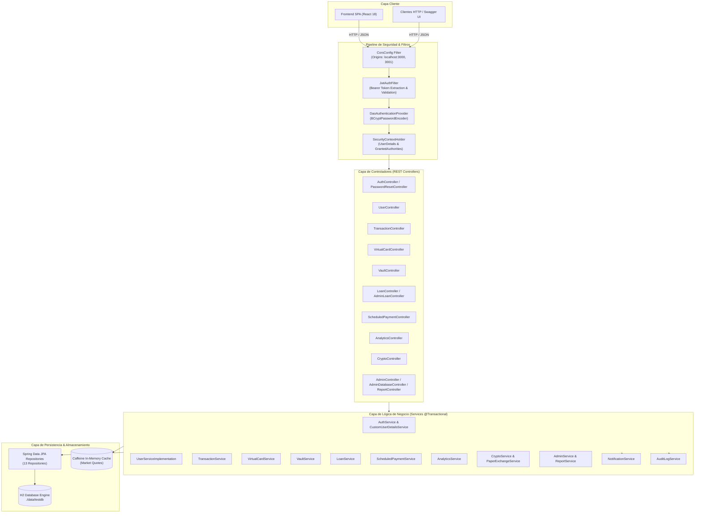
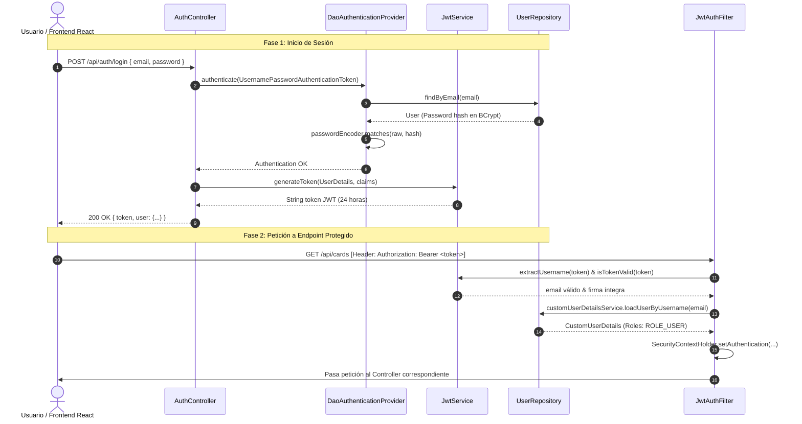
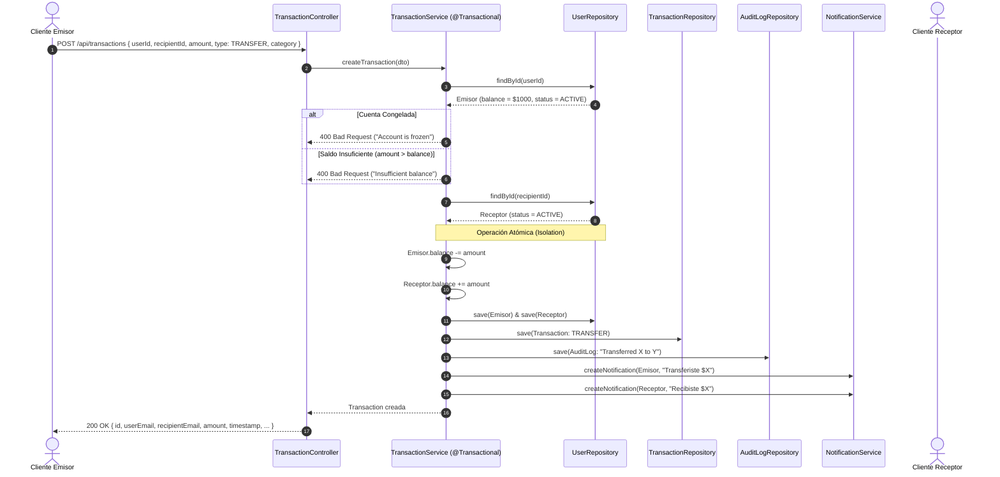
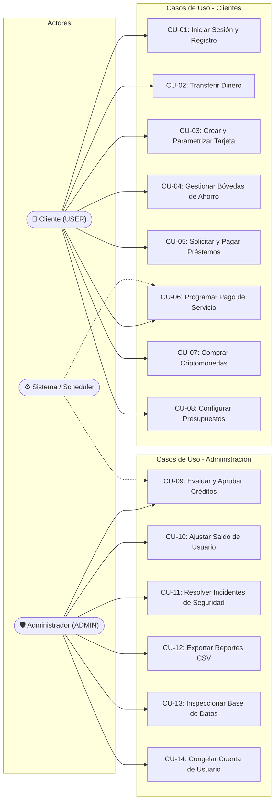

# 🏦 NeoBank — Documentación Integral del Backend, APIs, RF y Casos de Uso

---

## 📑 Tabla de Contenidos
1. [Visión General del Sistema](#1-visión-general-del-sistema)
2. [Stack Tecnológico y Dependencias](#2-stack-tecnológico-y-dependencias)
3. [Arquitectura del Backend y Diagramas](#3-arquitectura-del-backend-y-diagramas)
   - [3.1 Arquitectura en Capas y Flujo de Peticiones](#31-arquitectura-en-capas-y-flujo-de-peticiones)
   - [3.2 Diagrama Entidad-Relación (ERD)](#32-diagrama-entidad-relación-erd)
   - [3.3 Flujo de Autenticación y Autorización JWT](#33-flujo-de-autenticación-y-autorización-jwt)
   - [3.4 Flujo Transaccional Bancario ACID](#34-flujo-transaccional-bancario-acid)
4. [Requerimientos Funcionales (RF)](#4-requerimientos-funcionales-rf)
5. [Casos de Uso del Sistema (CU)](#5-casos-de-uso-del-sistema-cu)
   - [5.1 Diagrama de Casos de Uso](#51-diagrama-de-casos-de-uso)
   - [5.2 Fichas Descriptivas de Casos de Uso](#52-fichas-descriptivas-de-casos-de-uso)
6. [Catálogo Exhaustivo de APIs (REST Endpoints)](#6-catálogo-exhaustivo-de-apis-rest-endpoints)
   - [Módulo 1: Autenticación y Perfil (`/api/auth`, `/auth`)](#módulo-1-autenticación-y-perfil-apiauth-auth)
   - [Módulo 2: Gestión de Usuarios (`/api/users`)](#módulo-2-gestión-de-usuarios-apiusers)
   - [Módulo 3: Transacciones Financieras (`/api/transactions`)](#módulo-3-transacciones-financieras-apitransactions)
   - [Módulo 4: Tarjetas Virtuales (`/api/cards`)](#módulo-4-tarjetas-virtuales-apicards)
   - [Módulo 5: Bóvedas de Ahorro (`/api/vaults`)](#módulo-5-bóvedas-de-ahorro-apivaults)
   - [Módulo 6: Préstamos y Créditos (`/api/loans`, `/api/admin/loans`)](#módulo-6-préstamos-y-créditos-apiloans-apiadminloans)
   - [Módulo 7: Pagos Programados de Servicios (`/api/scheduled-payments`)](#módulo-7-pagos-programados-de-servicios-apischeduled-payments)
   - [Módulo 8: Analítica y Presupuestos (`/api/analytics`, `/api/budgets`)](#módulo-8-analítica-y-presupuestos-apianalytics-apibudgets)
   - [Módulo 9: Criptomonedas y Órdenes (`/api/crypto`)](#módulo-9-criptomonedas-y-órdenes-apicrypto)
   - [Módulo 10: Notificaciones (`/api/notifications`)](#módulo-10-notificaciones-apinotifications)
   - [Módulo 11: Administración y Monitoreo (`/api/admin`, `/admin`)](#módulo-11-administración-y-monitoreo-apiadmin-admin)
   - [Módulo 12: Explorador de Base de Datos H2 (`/api/admin/database`)](#módulo-12-explorador-de-base-de-datos-h2-apiadmindatabase)
   - [Módulo 13: Reportes y Exportación CSV (`/api/admin/reports`)](#módulo-13-reportes-y-exportación-csv-apiadminreports)
   - [Módulo 14: Registro de Auditoría (`/api/audit-logs`)](#módulo-14-registro-de-auditoría-apiaudit-logs)

---

## 1. Visión General del Sistema

**NeoBank** es una solución bancaria digital integral moderna diseñada bajo una arquitectura monolítica modular en **Spring Boot 3** (Java 21), desacoplada de un frontend en **React**.

El backend expone servicios REST seguros para:
- Gestión completa de identidad, control de acceso basado en roles (**RBAC**: `USER`, `ADMIN`) y emisión/validación de tokens JWT sin estado (*stateless*).
- Operaciones bancarias transaccionales (**depósitos, transferencias, retiros**) con consistencia ACID y aislamiento de saldos.
- Emisión, regeneración y parametrización de **tarjetas de débito/crédito virtuales y desechables** con control de límites diarios, PIN y bloqueo remoto.
- Creación de **bóvedas de ahorro por objetivos** con segregación de balances y reembolso automático.
- Módulo financiero de **créditos/préstamos** con simulación de amortización francesa, aprobación administrativa y desembolso automático.
- **Pagos de servicios y recurrencias** (luz, agua, internet, educación, etc.) con ejecución diferida, débito automático y calendarización.
- **Inteligencia de gastos y presupuestación** por categoría (comida, compras, transporte, entretenimiento, etc.) y analítica evolutiva de 6 meses.
- Módulo de **inversión en criptomonedas** (trading en modo paper exchange, caché de tickers Caffeine, compra/venta a mercado y billeteras integradas).
- **Consola administrativa de grado bancario**, con métricas globales, resolución de incidentes de ciberseguridad, bitácora de auditoría inmutable, exportación de reportes en CSV e inspector SQL protegido de solo lectura.

---

## 2. Stack Tecnológico y Dependencias

| Componente | Tecnología | Versión / Detalle |
|---|---|---|
| **Lenguaje de Programación** | Java | OpenJDK 21 LTS |
| **Framework Base** | Spring Boot | 3.5.3 |
| **Seguridad y Control de Acceso** | Spring Security 6 + JJWT | 0.11.5 (HMAC-SHA256, Stateless JWT) |
| **Capa de Persistencia** | Spring Data JPA / Hibernate Core | JPA 3.1 con generación DDL `update` |
| **Motor de Base de Datos** | H2 Database Engine | Persistencia local en archivo (`./data/testdb`) |
| **Caché en Memoria** | Caffeine Cache | Almacenamiento temporal de precios crypto (TTL 30s) |
| **Cliente HTTP Reactivo** | Spring WebFlux / WebClient | Consulta de cotizaciones de mercado |
| **Documentación de APIs** | SpringDoc OpenAPI (Swagger UI) | 2.7.0 (`/swagger-ui/index.html`) |
| **Utilidades y Productividad** | Project Lombok | Reducción de código boilerplate (@Getter, @Builder, etc.) |
| **Validación de Datos** | Jakarta Bean Validation | `@Valid`, `@NotNull`, `@Min`, etc. |

---

## 3. Arquitectura del Backend y Diagramas

### 3.1 Arquitectura en Capas y Flujo de Peticiones

El backend implementa un patrón arquitectónico en capas estricto (*Layered Architecture*), asegurando la separación de responsabilidades:



---

### 3.2 Diagrama Entidad-Relación (ERD)

El modelo relacional encapsula entidades financieras, perfiles de usuario, seguridad y transacciones:

```mermaid
erDiagram
    USERS ||--o{ TRANSACTIONS : "origina / recibe"
    USERS ||--o{ VIRTUAL_CARDS : "posee"
    USERS ||--o{ VAULTS : "crea"
    USERS ||--o{ LOANS : "solicita"
    USERS ||--o{ SCHEDULED_PAYMENTS : "programa"
    USERS ||--o{ BUDGETS : "establece"
    USERS ||--o{ NOTIFICATIONS : "recibe"
    USERS ||--o{ SUPPORT_TICKETS : "abre"
    USERS ||--o{ CRYPTO_HOLDINGS : "mantiene"
    USERS ||--o{ CRYPTO_ORDERS : "ejecuta"
    USERS ||--o{ PASSWORD_RESET_TOKENS : "solicita"
    LOANS ||--o{ LOAN_PAYMENTS : "contiene cuotas"

    USERS {
        bigint id PK
        varchar first_name
        varchar last_name
        varchar email UK
        varchar password
        varchar role "USER | ADMIN"
        numeric balance
        boolean is_verified
        varchar status "ACTIVE | FROZEN"
        boolean deleted
        varchar phone_number
        varchar address
        varchar city
        varchar postal_code
        varchar country
        timestamp created_at
    }

    TRANSACTIONS {
        bigint id PK
        bigint user_id FK
        bigint recipient_id FK
        numeric amount
        varchar type "DEPOSIT | WITHDRAWAL | TRANSFER"
        varchar category "FOOD | SERVICES | TRANSPORT | SHOPPING | ENTERTAINMENT | HEALTH | INVESTMENT | OTHER"
        varchar description
        timestamp timestamp
    }

    VIRTUAL_CARDS {
        bigint id PK
        bigint user_id FK
        varchar card_number
        varchar cvv
        date expiry_date
        varchar status "ACTIVE | FROZEN | DELETED"
        varchar card_type "VIRTUAL | PHYSICAL | DISPOSABLE"
        numeric daily_limit
        numeric monthly_limit
        varchar pin
        boolean online_payments_enabled
        varchar color
        varchar card_holder
    }

    VAULTS {
        bigint id PK
        bigint user_id FK
        varchar name
        numeric target_amount
        numeric current_amount
        boolean deleted
        timestamp created_at
    }

    LOANS {
        bigint id PK
        bigint user_id FK
        numeric amount
        int term_months
        numeric interest_rate
        numeric monthly_payment
        numeric total_repayment
        numeric remaining_balance
        varchar status "PENDING | APPROVED | REJECTED | PAID"
        varchar purpose
        varchar admin_notes
        timestamp created_at
        timestamp approved_at
    }

    LOAN_PAYMENTS {
        bigint id PK
        bigint loan_id FK
        numeric amount
        int installment_number
        timestamp payment_date
    }

    SCHEDULED_PAYMENTS {
        bigint id PK
        bigint user_id FK
        varchar title
        varchar service_type "ELECTRICITY | WATER | INTERNET | TELEPHONY | GAS | STREAMING | EDUCATION | CREDIT_CARD | RENT | OTHER"
        varchar account_reference
        numeric amount
        varchar frequency "ONE_TIME | WEEKLY | BIWEEKLY | MONTHLY"
        date next_execution_date
        varchar status "ACTIVE | PAUSED | COMPLETED"
        boolean auto_debit
        timestamp last_executed_at
        timestamp created_at
    }

    BUDGETS {
        bigint id PK
        bigint user_id FK
        varchar category
        numeric monthly_limit
        int month
        int year
    }

    CRYPTO_HOLDINGS {
        bigint id PK
        bigint user_id FK
        varchar symbol
        numeric quantity
    }

    CRYPTO_ORDERS {
        bigint id PK
        bigint user_id FK
        varchar symbol
        varchar side "BUY | SELL"
        numeric quantity
        numeric price
        numeric quote_amount
        varchar status "PENDING | FILLED | CANCELLED | REJECTED"
        timestamp created_at
    }

    AUDIT_LOGS {
        bigint id PK
        varchar action
        varchar performed_by
        varchar description
        timestamp time_stamp
    }

    SECURITY_INCIDENTS {
        bigint id PK
        varchar event_type
        varchar severity "LOW | MEDIUM | HIGH | CRITICAL"
        varchar target_user_email
        varchar description
        boolean resolved
        varchar resolution_notes
        timestamp created_at
    }
```



---

### 3.3 Flujo de Autenticación y Autorización JWT



---

### 3.4 Flujo Transaccional Bancario ACID



---

## 4. Requerimientos Funcionales (RF)

A continuación se enumeran formalmente los **Requerimientos Funcionales** del backend:

### Módulo 1: Autenticación, Usuarios y Seguridad
- **RF-01**: El sistema debe permitir el registro de nuevos usuarios clientes con validación estricta de correo electrónico único, formato de contraseñas y asignación del rol por defecto `USER` con saldo inicial cero.
- **RF-02**: El sistema debe autenticar credenciales de usuarios mediante contraseña encriptada con BCrypt y emitir un JSON Web Token (JWT) firmado con algoritmo HMAC-SHA256 con tiempo de expiración definido.
- **RF-03**: El sistema debe permitir consultar y modificar los datos del perfil del usuario autenticado (`/api/auth/me`), incluyendo dirección, teléfono, ciudad, código postal y país.
- **RF-04**: El sistema debe proveer recuperación de contraseña mediante la generación y validación de tokens temporales de un solo uso (`/auth/password-reset-request` y `/auth/password-reset`).
- **RF-05**: El sistema debe permitir el cambio de contraseña de usuarios autenticados verificando la contraseña anterior.
- **RF-06**: El sistema debe permitir a los administradores congelar (`freeze`), descongelar (`unfreeze`) y eliminar lógicamente cuentas de usuario.

### Módulo 2: Cuentas y Transacciones Financieras
- **RF-07**: El sistema debe procesar depósitos de dinero que incrementen de manera atómica el saldo de una cuenta.
- **RF-08**: El sistema debe procesar retiros de dinero debitando el saldo, validando que el monto a retirar no supere el saldo disponible y que la cuenta no esté congelada.
- **RF-09**: El sistema debe procesar transferencias entre dos usuarios de la plataforma garantizando atomicidad transaccional: débito al emisor y acreditación al receptor dentro de una misma transacción de base de datos.
- **RF-10**: El sistema debe clasificar cada transacción dentro de categorías financieras (`FOOD`, `SERVICES`, `TRANSPORT`, `SHOPPING`, `ENTERTAINMENT`, `HEALTH`, `INVESTMENT`, `OTHER`).
- **RF-11**: El sistema debe permitir la consulta de transacciones históricas filtradas por usuario, rangos de fecha y umbrales de monto mayor/menor que.

### Módulo 3: Tarjetas Virtuales y Seguridad de Medios de Pago
- **RF-12**: El sistema debe generar tarjetas de crédito/débito virtuales asociadas al usuario con numeración pseudoaleatoria conforme a prefijos bancarios (BIN 4567...), fecha de caducidad automática y código CVV seguro.
- **RF-13**: El sistema debe soportar tarjetas en tres modalidades: `VIRTUAL` (estándar), `PHYSICAL` (física digitalizada) y `DISPOSABLE` (de un solo uso / caducidad a 1 año).
- **RF-14**: El sistema debe permitir al usuario ajustar límites operativos independientes para compras diarias y mensuales.
- **RF-15**: El sistema debe permitir el cambio del PIN de 4 dígitos y el bloqueo/desbloqueo (*freeze/unfreeze*) inmediato de cualquier tarjeta.
- **RF-16**: El sistema debe permitir la regeneración de credenciales (nuevo número y nuevo CVV) sin perder la asociación a la cuenta.

### Módulo 4: Bóvedas de Ahorro y Metas Financieras
- **RF-17**: El sistema debe permitir al usuario crear múltiples bóvedas de ahorro fijando un nombre y una meta cuantitativa (*targetAmount*).
- **RF-18**: El sistema debe permitir ingresar fondos desde el saldo principal de la cuenta bancaria hacia una bóveda específica debitando el balance general.
- **RF-19**: El sistema debe permitir retirar fondos acumulados en una bóveda de regreso al saldo disponible en cualquier momento sin penalizaciones.
- **RF-20**: El sistema debe reembolsar automáticamente todo el saldo acumulado en una bóveda hacia el saldo principal cuando el usuario decida eliminarla (*soft delete*).

### Módulo 5: Créditos y Préstamos
- **RF-21**: El sistema debe ofrecer un simulador de préstamos público que calcule cuotas mensuales fijas, interés total devengado y costo financiero total usando la fórmula del sistema de amortización francés a una tasa anual predeterminada (12% anual).
- **RF-22**: El sistema debe permitir a los clientes autenticados postular a solicitudes de crédito especificando monto, plazo en meses y propósito del financiamiento.
- **RF-23**: El sistema debe permitir exclusivamente al rol `ADMIN` revisar, aprobar o rechazar solicitudes de préstamo con notas de resolución justificativas.
- **RF-24**: Al aprobarse un préstamo, el sistema debe desembolsar inmediatamente el monto total al saldo principal del usuario y registrar una transacción de depósito.
- **RF-25**: El sistema debe permitir al usuario pagar cuotas ordinarias o realizar amortizaciones extraordinarias, debitando su saldo, actualizando el saldo deudor pendiente y marcando el crédito como `PAID` al saldarse por completo.

### Módulo 6: Pagos Programados y Servicios
- **RF-26**: El sistema debe permitir registrar pagos programados para servicios públicos o privados (`ELECTRICITY`, `WATER`, `INTERNET`, `STREAMING`, etc.) indicando código de suministro/referencia.
- **RF-27**: El sistema debe admitir frecuencias de pago: pago único (`ONE_TIME`), semanal (`WEEKLY`), quincenal (`BIWEEKLY`) o mensual (`MONTHLY`).
- **RF-28**: El sistema debe permitir ejecutar el pago de manera inmediata en el momento de la creación o calendarizarlo para una fecha futura con débito automático (*autoDebit*).
- **RF-29**: El sistema debe permitir pausar, reanudar o forzar la ejecución manual inmediata de cualquier pago programado.

### Módulo 7: Finanzas Personales, Presupuestos y Analítica
- **RF-30**: El sistema debe calcular el desglose de gastos agrupados por categoría para un mes y año determinados.
- **RF-31**: El sistema debe generar la tendencia evolutiva financiera de los últimos 6 meses, comparando ingresos totales, egresos totales y resultado neto mensual.
- **RF-32**: El sistema debe permitir fijar límites de presupuesto mensual por categoría y calcular el porcentaje de consumo en tiempo real.
- **RF-33**: El sistema debe permitir buscar usuarios por coincidencia de nombre o correo electrónico y obtener la lista de contactos frecuentes basada en transferencias previas.

### Módulo 8: Criptomonedas y Órdenes de Mercado
- **RF-34**: El sistema debe proveer cotizaciones en tiempo real para criptoactivos (BTC, ETH, SOL, etc.) respaldadas por caché en memoria Caffeine con TTL de 30 segundos.
- **RF-35**: El sistema debe ofrecer una calculadora de conversión entre criptomonedas y monedas fiat (USD).
- **RF-36**: El sistema debe registrar billeteras de criptoactivos (*holdings*) por usuario, reflejando las cantidades exactas adquiridas.
- **RF-37**: El sistema debe ejecutar órdenes de mercado de compra (`BUY`) y venta (`SELL`): al comprar debita saldo fiat y acredita tokens; al vender debita tokens y acredita saldo fiat a la cuenta bancaria.

### Módulo 9: Notificaciones y Centro de Alertas
- **RF-38**: El sistema debe generar notificaciones internas automáticas ante cada suceso bancario relevante (depósitos, retiros, transferencias, estados de créditos, movimientos en tarjetas, alertas de seguridad).
- **RF-39**: El sistema debe listar las notificaciones del usuario y permitir marcarlas como leídas.

### Módulo 10: Administración, Auditoría e Infraestructura
- **RF-40**: El sistema debe calcular métricas operativas globales en tiempo real: volumen total depositado, cartera de créditos activa, total ahorrado en bóvedas, transacciones en las últimas 24h, incidentes no resueltos y tickets abiertos.
- **RF-41**: El sistema debe permitir al administrador realizar ajustes de balance manuales (tipo `CREDIT` o `DEBIT`) sobre cualquier usuario, registrando la justificación obligatoria y la traza en auditoría.
- **RF-42**: El sistema debe registrar un historial inmutable de auditoría (`AuditLog`) para todas las acciones administrativas y transaccionales críticas.
- **RF-43**: El sistema debe permitir al administrador resolver incidentes de seguridad agregando notas explicativas.
- **RF-44**: El sistema debe permitir la exportación de reportes ejecutivos en formato CSV descargable para el banco general y por usuario individual.
- **RF-45**: El sistema debe proporcionar una consola de base de datos para administradores que permita inspeccionar tablas del esquema H2 y ejecutar consultas de solo lectura (`SELECT`/`EXPLAIN`) bloqueando de forma estricta cualquier sentencia DDL o DML maliciosa.

---

## 5. Casos de Uso del Sistema (CU)

### 5.1 Diagrama de Casos de Uso



---

### 5.2 Fichas Descriptivas de Casos de Uso

#### CU-01: Registro e Inicio de Sesión de Usuario
- **Actor Principal**: Usuario / Cliente no autenticado.
- **Precondiciones**: Ninguna.
- **Flujo Principal**:
  1. El usuario envía sus datos (nombre, apellido, correo, contraseña) a `/api/auth/register` o sus credenciales a `/api/auth/login`.
  2. El sistema valida formato de correo electrónico y contraseña.
  3. En login, el sistema verifica el hash BCrypt y genera un token JWT con tiempo de vida de 24 horas.
  4. El sistema retorna el token JWT y los datos públicos del usuario.
- **Flujos Alternos**:
  - *Contraseña incorrecta o correo no registrado*: El sistema retorna error HTTP 401/403.
  - *Correo duplicado en registro*: El sistema rechaza la solicitud con mensaje descriptivo.
- **Postcondiciones**: El cliente almacena el token JWT y tiene acceso a los endpoints protegidos bajo el rol `ROLE_USER`.

#### CU-02: Transferencia de Fondos entre Cuentas NeoBank
- **Actor Principal**: Cliente con cuenta activa (`ROLE_USER`).
- **Precondiciones**:
  - El usuario debe estar autenticado con JWT.
  - Su cuenta bancaria no debe estar en estado `FROZEN`.
  - Debe contar con saldo igual o superior al monto a transferir.
- **Flujo Principal**:
  1. El cliente especifica el `recipientId`, `amount`, `category` y `description`.
  2. El sistema verifica que el destinatario exista y no esté congelado.
  3. El sistema debita el monto del saldo del emisor y lo acredita en el saldo del receptor dentro de una transacción atómica `@Transactional`.
  4. Se crea un registro de transacción de tipo `TRANSFER`.
  5. Se registra la acción en `AuditLog`.
  6. Se envían notificaciones internas automáticas a ambas partes.
  7. Se retorna el comprobante de la transacción con HTTP 200.
- **Flujos Alternos**:
  - *Saldo insuficiente*: El sistema aborta la transacción y devuelve HTTP 400.
  - *Cuenta emisora o receptora congelada*: El sistema aborta la transacción y devuelve HTTP 400 con motivo del bloqueo.

#### CU-03: Emisión y Parametrización de Tarjeta Virtual
- **Actor Principal**: Cliente autenticado (`ROLE_USER`).
- **Precondiciones**: Usuario activo en el sistema.
- **Flujo Principal**:
  1. El cliente envía solicitud indicando tipo de tarjeta (`VIRTUAL`, `PHYSICAL` o `DISPOSABLE`), límites diarios/mensuales deseados y PIN.
  2. El sistema genera un número de tarjeta con algoritmo pseudoaleatorio seguro (prefijo Visa/Master 4567...) y CVV de 3 dígitos.
  3. Se establece fecha de caducidad automática (3 años para virtuales/físicas, 1 año para desechables).
  4. Se guarda en la base de datos con estado `ACTIVE`.
  5. Se notifica al usuario de la emisión de su nueva tarjeta.
- **Flujos Alternos**:
  - *PIN inválido*: Si no cumple con exactamente 4 dígitos numéricos, el sistema rechaza la solicitud.
- **Postcondiciones**: La tarjeta queda habilitada para operaciones y visualización segura en el portal del cliente.

#### CU-04: Creación y Ahorro en Bóveda
- **Actor Principal**: Cliente autenticado (`ROLE_USER`).
- **Precondiciones**: Saldo suficiente en la cuenta principal para los depósitos.
- **Flujo Principal**:
  1. El cliente crea una meta de ahorro indicando nombre (ej: "Vacaciones 2026") y monto objetivo.
  2. El usuario ejecuta un depósito indicando el monto.
  3. El sistema debita el monto del balance principal y lo acredita al `currentAmount` de la bóveda.
  4. El sistema calcula el porcentaje de avance respecto a la meta (0% a 100%).
  5. Si el usuario decide eliminar la bóveda, el sistema reintegra automáticamente la totalidad de fondos acumulados al saldo principal.
- **Flujos Alternos**:
  - *Monto de depósito excede saldo*: El sistema devuelve HTTP 400 por fondos insuficientes.

#### CU-05: Simulación y Solicitud de Préstamo
- **Actor Principal**: Cliente autenticado (`ROLE_USER`).
- **Precondiciones**: Usuario activo sin suspensiones.
- **Flujo Principal**:
  1. El cliente consulta el simulador `/api/loans/simulate` enviando monto y plazo en meses.
  2. El sistema aplica el sistema de amortización francés a 12% anual y devuelve cuota mensual estimada e interés total.
  3. El cliente confirma y envía la solicitud formal con el propósito crediticio.
  4. El sistema registra el crédito en estado `PENDING`.
  5. Se genera notificación al cliente y registro de auditoría `LOAN_APPLIED`.
- **Postcondiciones**: El crédito queda en espera de evaluación y aprobación por el equipo de administración.

#### CU-06: Aprobación de Préstamo y Desembolso Automático
- **Actor Principal**: Administrador del banco (`ROLE_ADMIN`).
- **Precondiciones**: Préstamo existente en estado `PENDING`.
- **Flujo Principal**:
  1. El administrador lista los préstamos pendientes en `/api/admin/loans`.
  2. El administrador aprueba el préstamo mediante `PATCH /api/admin/loans/{id}/approve` adjuntando notas resolutivas.
  3. El sistema cambia el estado a `APPROVED` y registra la fecha de aprobación.
  4. **Desembolso inmediato**: El sistema acredita automáticamente el monto aprobado al saldo bancario del cliente solicitante.
  5. Se registra una transacción financiera de tipo `DEPOSIT` (categoría `INVESTMENT`).
  6. Se envía notificación de felicitaciones y disponibilidad de fondos al cliente.
  7. Se registra el suceso en la bitácora inmutable de auditoría.
- **Flujos Alternos**:
  - *Rechazo*: El administrador ejecuta `PATCH /api/admin/loans/{id}/reject`; el estado pasa a `REJECTED`, no se mueven fondos y se notifica al usuario con el motivo del rechazo.

#### CU-07: Programación y Ejecución de Pago de Servicios
- **Actor Principal**: Cliente autenticado (`ROLE_USER`).
- **Precondiciones**: Disponibilidad de fondos en caso de pago inmediato.
- **Flujo Principal**:
  1. El cliente selecciona el servicio (Luz, Agua, Internet, Streaming, etc.) e ingresa el código de suministro y monto.
  2. El cliente define la frecuencia (`ONE_TIME`, `WEEKLY`, `BIWEEKLY`, `MONTHLY`).
  3. Si marca `payNow = true`, el sistema descuenta el saldo en ese instante, registra la transacción y calcula la próxima fecha de cobro.
  4. Si marca pago futuro con débito automático, queda en estado `ACTIVE` para su fecha programada.
  5. El cliente puede pausar o reanudar el cobro automático en cualquier momento.

#### CU-08: Compra / Venta de Criptomonedas a Mercado
- **Actor Principal**: Cliente autenticado (`ROLE_USER`).
- **Precondiciones**:
  - Saldo en USD suficiente para compras (`BUY`).
  - Cantidad suficiente del token crypto en portafolio para ventas (`SELL`).
- **Flujo Principal**:
  1. El cliente consulta las cotizaciones de mercado en `/api/crypto/tickers`.
  2. El cliente envía orden a mercado en `/api/crypto/order` indicando símbolo (ej: `BTC`), tipo (`BUY` o `SELL`) y monto en USD (`quoteAmount`).
  3. El sistema obtiene el precio actual del activo desde el caché o el proveedor.
  4. Calcula la cantidad de criptomoneda a adquirir o liquidar.
  5. Para `BUY`: debita saldo fiat y añade la cantidad a `CryptoHolding`.
  6. Para `SELL`: debita el token de `CryptoHolding` y añade el dinero fiat obtenido al balance de la cuenta.
  7. Registra la orden con estado `FILLED` y retorna el comprobante.

#### CU-09: Ajuste Manual de Saldo y Auditoría Bancaria
- **Actor Principal**: Administrador del banco (`ROLE_ADMIN`).
- **Precondiciones**: Existencia del usuario objetivo y justificación bancaria válida.
- **Flujo Principal**:
  1. El administrador envía solicitud `POST /api/admin/users/{id}/adjust-balance` con monto, tipo (`CREDIT` o `DEBIT`) y motivo.
  2. El sistema valida que para débitos el usuario tenga saldo suficiente.
  3. El sistema actualiza el saldo del usuario.
  4. Crea una transacción de ajuste para reflejo contable.
  5. Inserta un registro estricto en `AuditLog` con la identidad del administrador, fecha exacta, monto y justificación.
  6. Notifica al usuario sobre el ajuste aplicado por el banco.

#### CU-10: Inspección y Consulta Segura de Base de Datos H2
- **Actor Principal**: Administrador del banco (`ROLE_ADMIN`).
- **Precondiciones**: Sesión administrativa activa.
- **Flujo Principal**:
  1. El administrador consulta la estructura y cantidad de registros de las tablas del sistema en `/api/admin/database/overview`.
  2. Puede visualizar registros paginados con búsqueda en `/api/admin/database/tables/{tableName}`.
  3. El administrador puede ejecutar consultas SQL personalizadas en `/api/admin/database/query`.
  4. El sistema evalúa la consulta contra un filtro de seguridad regex:
     - **Regla estricta**: Solo se permiten sentencias que comiencen con `SELECT` o `EXPLAIN`.
     - **Bloqueo preventivo**: Palabras clave como `DROP`, `DELETE`, `UPDATE`, `INSERT`, `ALTER`, `TRUNCATE`, `EXEC`, `CREATE` son bloqueadas con HTTP 400.
     - **Auto-limit**: Si la consulta no incluye cláusula `LIMIT`, el sistema anexa automáticamente `LIMIT 50` para evitar saturación de memoria.
  5. El sistema ejecuta la lectura y devuelve resultados, columnas, cantidad de filas y tiempo de ejecución en milisegundos.

---

## 6. Catálogo Exhaustivo de APIs (REST Endpoints)

A continuación se detalla cada uno de los controladores y endpoints expuestos en el backend de NeoBank.

---

### Módulo 1: Autenticación y Perfil (`/api/auth`, `/auth`)

#### 1. Registro de Usuario
- **Método**: `POST`
- **Ruta**: `/api/auth/register`
- **Seguridad**: Público
- **Request Body** (`AuthRequest`):
  ```json
  {
    "firstName": "Carlos",
    "lastName": "Gómez",
    "email": "carlos@example.com",
    "password": "password123"
  }
  ```
- **Response** (200 OK - `AuthResponse`):
  ```json
  {
    "token": "eyJhbGciOiJIUzI1NiIsInR5cCI6IkpXVCJ9...",
    "user": {
      "id": 3,
      "firstName": "Carlos",
      "lastName": "Gómez",
      "email": "carlos@example.com",
      "role": "USER",
      "balance": 0.00,
      "status": "ACTIVE"
    }
  }
  ```

#### 2. Inicio de Sesión
- **Método**: `POST`
- **Ruta**: `/api/auth/login`
- **Seguridad**: Público
- **Request Body** (`LoginRequest`):
  ```json
  {
    "email": "demo@bank.com",
    "password": "demo123"
  }
  ```
- **Response** (200 OK - `AuthResponse`):
  ```json
  {
    "token": "eyJhbGciOiJIUzI1NiIsInR5cCI6IkpXVCJ9...",
    "user": {
      "id": 2,
      "firstName": "Carlos",
      "lastName": "Gómez",
      "email": "demo@bank.com",
      "role": "USER",
      "balance": 14500.00,
      "status": "ACTIVE"
    }
  }
  ```

#### 3. Obtener Perfil del Usuario Autenticado
- **Método**: `GET`
- **Ruta**: `/api/auth/me`
- **Seguridad**: Requiere autenticación (`USER` o `ADMIN`)
- **Headers**: `Authorization: Bearer <token>`
- **Response** (200 OK - `UserResponseDTO`):
  ```json
  {
    "id": 2,
    "firstName": "Carlos",
    "lastName": "Gómez",
    "email": "demo@bank.com",
    "role": "USER",
    "balance": 14500.00,
    "status": "ACTIVE",
    "isVerified": true,
    "phoneNumber": "+51 987 654 321",
    "address": "Av. Javier Prado Este 2465",
    "city": "Lima",
    "postalCode": "15036",
    "country": "Perú"
  }
  ```

#### 4. Actualizar Perfil de Usuario
- **Método**: `PUT`
- **Ruta**: `/api/auth/me`
- **Seguridad**: Requiere autenticación (`USER` o `ADMIN`)
- **Request Body** (`ProfileUpdateDTO`):
  ```json
  {
    "firstName": "Carlos",
    "lastName": "Gómez P.",
    "phoneNumber": "+51 999 888 777",
    "address": "Calle Las Begonias 450",
    "city": "Lima",
    "postalCode": "15046",
    "country": "Perú"
  }
  ```
- **Response** (200 OK - `UserResponseDTO` actualizado)

#### 5. Solicitud de Recuperación de Contraseña
- **Método**: `POST`
- **Ruta**: `/auth/password-reset-request`
- **Seguridad**: Público
- **Query Params**: `email=usuario@example.com`
- **Response** (200 OK): `"Password reset token generated: <UUID-TOKEN>"`

#### 6. Ejecutar Restablecimiento de Contraseña con Token
- **Método**: `POST`
- **Ruta**: `/auth/password-reset`
- **Seguridad**: Público
- **Query Params**: `token=<UUID-TOKEN>&newPassword=nuevoPassword123`
- **Response** (200 OK): `"Password has been reset successfully."`

#### 7. Cambiar Contraseña de Usuario Autenticado
- **Método**: `PATCH`
- **Ruta**: `/auth/change-password`
- **Seguridad**: Requiere autenticación
- **Request Body**:
  ```json
  {
    "oldPassword": "passwordViejo123",
    "newPassword": "passwordNuevo456"
  }
  ```
- **Response** (200 OK): `"Password changed successfully"`

---

### Módulo 2: Gestión de Usuarios (`/api/users`)

| Método | Endpoint | Roles | Descripción |
|---|---|---|---|
| `GET` | `/api/users` | `ADMIN` | Lista todos los usuarios del sistema |
| `GET` | `/api/users/{id}` | Autenticado | Obtiene datos de un usuario por su ID |
| `GET` | `/api/users/email/{email}` | Autenticado | Obtiene datos de un usuario por su email |
| `PUT` | `/api/users/{id}` | Autenticado | Actualiza datos de usuario |
| `PATCH` | `/api/users/{id}/freeze` | `ADMIN` | Congela la cuenta (bloquea retiros y transferencias) |
| `PATCH` | `/api/users/{id}/unfreeze` | `ADMIN` | Reactiva una cuenta previamente congelada |
| `DELETE` | `/api/users/{id}` | `ADMIN` | Eliminación lógica de un usuario |
| `GET` | `/api/users/search?q={query}` | `USER`, `ADMIN` | Búsqueda rápida de usuarios para transferencias |
| `GET` | `/api/users/contacts` | `USER`, `ADMIN` | Retorna contactos frecuentes del usuario conectado |

---

### Módulo 3: Transacciones Financieras (`/api/transactions`)

#### 1. Crear Transacción (Depósito / Retiro / Transferencia)
- **Método**: `POST`
- **Ruta**: `/api/transactions`
- **Seguridad**: Requiere autenticación
- **Request Body** (`TransactionRequestDTO`):
  ```json
  {
    "userId": 2,
    "recipientId": 1,
    "amount": 250.00,
    "type": "TRANSFER",
    "category": "SERVICES",
    "description": "Pago de cuota de mantenimiento"
  }
  ```
  *(Nota: Para `DEPOSIT` el `recipientId` es opcional; para `TRANSFER` es obligatorio).*
- **Response** (200 OK - `TransactionResponseDTO`):
  ```json
  {
    "id": 15,
    "userEmail": "demo@bank.com",
    "recipientEmail": "admin@bank.com",
    "amount": 250.00,
    "type": "TRANSFER",
    "description": "Pago de cuota de mantenimiento",
    "timestamp": "2026-09-08T17:45:00",
    "category": "SERVICES"
  }
  ```

#### 2. Consultas de Transacciones por Usuario y Filtros
- `GET /api/transactions/user/{userId}`: Lista todas las transacciones vinculadas a un usuario.
- `GET /api/transactions/user/{userId}/date-range?start={ISO_DATE}&end={ISO_DATE}`: Filtra transacciones entre dos marcas de tiempo.
- `GET /api/transactions/user/{userId}/above?amount={valor}`: Filtra transacciones con montos estrictamente superiores al valor.
- `GET /api/transactions/user/{userId}/below?amount={valor}`: Filtra transacciones con montos estrictamente inferiores al valor.

---

### Módulo 4: Tarjetas Virtuales (`/api/cards`)

| Método | Endpoint | Roles | Descripción |
|---|---|---|---|
| `GET` | `/api/cards` | `USER`, `ADMIN` | Obtiene todas las tarjetas activas del usuario autenticado |
| `POST` | `/api/cards` | `USER`, `ADMIN` | Emite una nueva tarjeta con límites y color opcionales |
| `PATCH` | `/api/cards/{id}/freeze` | `USER`, `ADMIN` | Bloquea temporalmente la tarjeta seleccionada |
| `PATCH` | `/api/cards/{id}/unfreeze` | `USER`, `ADMIN` | Desbloquea y reactiva la tarjeta seleccionada |
| `PATCH` | `/api/cards/{id}/limits` | `USER`, `ADMIN` | Modifica límite diario y/o mensual de gasto |
| `PATCH` | `/api/cards/{id}/pin` | `USER`, `ADMIN` | Cambia el código de seguridad PIN de 4 dígitos |
| `PATCH` | `/api/cards/{id}/toggle-online` | `USER`, `ADMIN` | Habilita o deshabilita compras por internet |
| `POST` | `/api/cards/{id}/regenerate` | `USER`, `ADMIN` | Regenera número de tarjeta y CVV manteniendo la cuenta |
| `DELETE` | `/api/cards/{id}` | `USER`, `ADMIN` | Cancela y borra la tarjeta (`status = DELETED`) |

**Ejemplo de creación de tarjeta (`POST /api/cards`)**:
```json
{
  "cardType": "VIRTUAL",
  "dailyLimit": 800.00,
  "monthlyLimit": 3000.00,
  "pin": "4589",
  "color": "emerald",
  "cardHolder": "CARLOS GOMEZ"
}
```

---

### Módulo 5: Bóvedas de Ahorro (`/api/vaults`)

| Método | Endpoint | Roles | Descripción |
|---|---|---|---|
| `GET` | `/api/vaults` | `USER`, `ADMIN` | Lista las bóvedas activas del usuario con % de progreso |
| `POST` | `/api/vaults` | `USER`, `ADMIN` | Crea una nueva bóveda con nombre y meta de ahorro |
| `POST` | `/api/vaults/{id}/deposit` | `USER`, `ADMIN` | Traspasa dinero del balance general hacia la bóveda |
| `POST` | `/api/vaults/{id}/withdraw` | `USER`, `ADMIN` | Retira fondos de la bóveda de vuelta al balance general |
| `DELETE` | `/api/vaults/{id}` | `USER`, `ADMIN` | Elimina la bóveda y reembolsa el 100% de fondos restantes |

**Ejemplo de depósito en bóveda (`POST /api/vaults/1/deposit`)**:
```json
{
  "amount": 500.00
}
```

---

### Módulo 6: Préstamos y Créditos (`/api/loans`, `/api/admin/loans`)

#### Endpoints para Clientes (`/api/loans`):
- `POST /api/loans/simulate` (Público): Simula cuota e intereses a 12% anual.
  - Request: `{"amount": 10000.00, "termMonths": 24}`
  - Response: `{ "amount": 10000.00, "termMonths": 24, "annualInterestRate": 12.00, "monthlyPayment": 470.73, "totalRepayment": 11297.52, "totalInterest": 1297.52 }`
- `POST /api/loans/apply` (`USER`, `ADMIN`): Radica una solicitud formal de crédito.
  - Request: `{"amount": 5000.00, "termMonths": 12, "purpose": "Remodelación de hogar"}`
- `GET /api/loans` (`USER`, `ADMIN`): Lista todos los préstamos solicitados por el usuario.
- `POST /api/loans/{id}/pay` (`USER`, `ADMIN`): Paga una cuota ordinaria o amortización anticipada.
  - Request: `{"amount": 470.73}` *(opcional, si es null toma la cuota mensual)*.

#### Endpoints Administrativos (`/api/admin/loans`):
- `GET /api/admin/loans` (`ADMIN`): Lista todos los préstamos del banco ordenados por fecha.
- `PATCH /api/admin/loans/{id}/approve` (`ADMIN`): Aprueba el crédito, desembolsa fondos y notifica.
  - Request: `{"notes": "Cliente solvente con historial favorable"}`
- `PATCH /api/admin/loans/{id}/reject` (`ADMIN`): Deniega la solicitud.
  - Request: `{"notes": "Capacidad de endeudamiento superada"}`

---

### Módulo 7: Pagos Programados de Servicios (`/api/scheduled-payments`)

| Método | Endpoint | Roles | Descripción |
|---|---|---|---|
| `GET` | `/api/scheduled-payments` | `USER`, `ADMIN` | Lista los servicios y pagos programados del cliente |
| `POST` | `/api/scheduled-payments` | `USER`, `ADMIN` | Registra un nuevo servicio para pago programado |
| `POST` | `/api/scheduled-payments/{id}/execute` | `USER`, `ADMIN` | Ejecuta de inmediato el pago pendiente de un servicio |
| `PATCH` | `/api/scheduled-payments/{id}/toggle-pause` | `USER`, `ADMIN` | Alterna entre estado `ACTIVE` y `PAUSED` |
| `DELETE` | `/api/scheduled-payments/{id}` | `USER`, `ADMIN` | Cancela y elimina la programación del pago |

**Ejemplo de creación (`POST /api/scheduled-payments`)**:
```json
{
  "title": "Recibo de Luz Enel",
  "serviceType": "ELECTRICITY",
  "accountReference": "SUM-8941203",
  "amount": 145.50,
  "frequency": "MONTHLY",
  "nextExecutionDate": "2026-09-25",
  "autoDebit": true,
  "payNow": false
}
```

---

### Módulo 8: Analítica y Presupuestos (`/api/analytics`, `/api/budgets`)

| Método | Endpoint | Roles | Descripción |
|---|---|---|---|
| `GET` | `/api/analytics/spending-by-category` | `USER`, `ADMIN` | Gasto acumulado, conteo y % de presupuesto por categoría (`month`, `year`) |
| `GET` | `/api/analytics/monthly-trend` | `USER`, `ADMIN` | Evolución financiera de los últimos 6 meses (ingresos, gastos, balance neto) |
| `GET` | `/api/budgets` | `USER`, `ADMIN` | Obtiene límites de presupuesto definidos para el mes |
| `POST` | `/api/budgets` | `USER`, `ADMIN` | Asigna o actualiza el presupuesto mensual para una categoría |
| `DELETE` | `/api/budgets/{id}` | `USER`, `ADMIN` | Elimina un presupuesto específico |

---

### Módulo 9: Criptomonedas y Órdenes (`/api/crypto`)

| Método | Endpoint | Roles | Descripción |
|---|---|---|---|
| `GET` | `/api/crypto/tickers?symbols=BTC,ETH` | Público | Obtiene precio spot, cambio 24h y volumen con caché |
| `GET` | `/api/crypto/convert?from=BTC&to=USD&amount=0.5` | Público | Calculadora de conversión de divisas |
| `GET` | `/api/crypto/me/holdings` | `USER`, `ADMIN` | Portafolio personal de activos crypto en tenencia |
| `GET` | `/api/crypto/me/orders` | `USER`, `ADMIN` | Historial de órdenes de compra/venta ejecutadas |
| `POST` | `/api/crypto/order` | `USER`, `ADMIN` | Coloca orden a mercado (`BUY` o `SELL`) con impacto en balance |

**Ejemplo de compra crypto (`POST /api/crypto/order`)**:
```json
{
  "symbol": "BTC",
  "side": "BUY",
  "quoteAmount": 1000.00
}
```

---

### Módulo 10: Notificaciones (`/api/notifications`)

| Método | Endpoint | Roles | Descripción |
|---|---|---|---|
| `GET` | `/api/notifications` | `USER`, `ADMIN` | Lista todas las notificaciones recibidas por el usuario |
| `PATCH` | `/api/notifications/{id}/read` | `USER`, `ADMIN` | Marca una notificación específica como leída |

---

### Módulo 11: Administración y Monitoreo (`/api/admin`, `/admin`)

| Método | Endpoint | Roles | Descripción |
|---|---|---|---|
| `GET` | `/api/admin/overview` | `ADMIN` | Panel ejecutivo: KPIs, flujo de caja 7 días, distribución de activos, incidentes |
| `GET` | `/api/admin/total-balance` | `ADMIN` | Sumatoria global de depósitos custodiados en el banco |
| `GET` | `/api/admin/user-stats` | `ADMIN` | Conteo de usuarios clasificados: activos, congelados y eliminados |
| `GET` | `/api/admin/recent-transactions?limit=10` | `ADMIN` | Últimas N transacciones registradas en toda la plataforma |
| `POST` | `/api/admin/users/{id}/adjust-balance` | `ADMIN` | Modifica manualmente el saldo de un usuario con auditoría |
| `PATCH` | `/api/admin/security-incidents/{id}/resolve` | `ADMIN` | Marca un incidente de seguridad como resuelto con notas |

**Ejemplo de ajuste de saldo administrativo (`POST /api/admin/users/2/adjust-balance`)**:
```json
{
  "amount": 250.00,
  "type": "CREDIT",
  "reason": "Reembolso por transacción duplicada de comercio externo"
}
```

---

### Módulo 12: Explorador de Base de Datos H2 (`/api/admin/database`)

| Método | Endpoint | Roles | Descripción |
|---|---|---|---|
| `GET` | `/api/admin/database/overview` | `ADMIN` | Inspecciona motor H2, lista tablas del esquema PUBLIC y conteo de filas |
| `GET` | `/api/admin/database/tables/{tableName}` | `ADMIN` | Consulta paginada y con búsqueda ILIKE en cualquier tabla del sistema |
| `POST` | `/api/admin/database/query` | `ADMIN` | Ejecuta consultas SQL de solo lectura (`SELECT`/`EXPLAIN`) con protección regex |

**Ejemplo de consulta SQL administrativa (`POST /api/admin/database/query`)**:
```json
{
  "query": "SELECT email, role, balance, status FROM USERS WHERE balance > 1000 ORDER BY balance DESC"
}
```

---

### Módulo 13: Reportes y Exportación CSV (`/api/admin/reports`)

| Método | Endpoint | Roles | Descripción |
|---|---|---|---|
| `GET` | `/api/admin/reports` | `ADMIN` | Métricas consolidadas en JSON (usuarios, saldo total, conteo por transacción) |
| `GET` | `/api/admin/reports/export` | `ADMIN` | Descarga archivo CSV con el reporte general administrativo |
| `GET` | `/api/admin/reports/user/{userId}/export` | `ADMIN` | Descarga archivo CSV con el estado de cuenta y movimientos de un cliente |

---

### Módulo 14: Registro de Auditoría (`/api/audit-logs`)

| Método | Endpoint | Roles | Descripción |
|---|---|---|---|
| `GET` | `/api/audit-logs` | `ADMIN` | Lista la bitácora inmutable de eventos sensibles del sistema |

---

*Documentación técnica generada para la plataforma bancaria digital NeoBank.*
